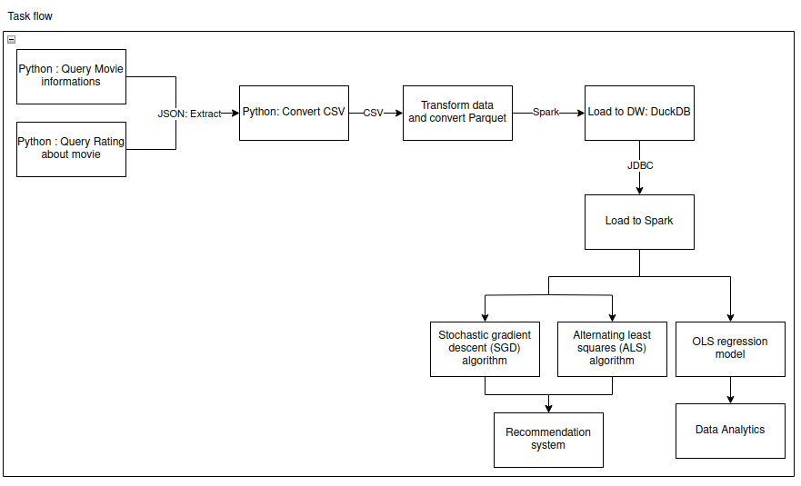
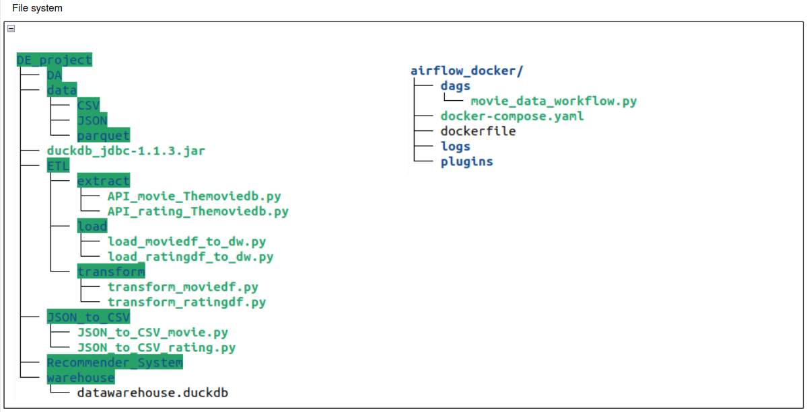
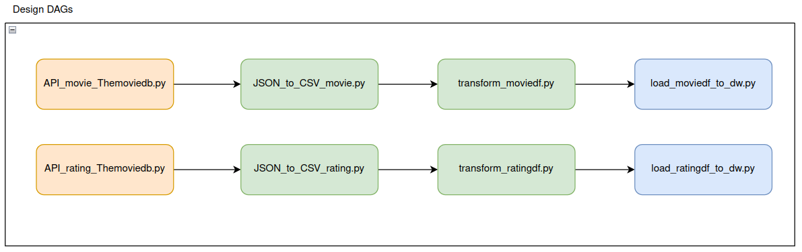

## Giới thiệu

### Đối tượng nghiên cứu
Dữ liệu phim của 500 trang, với khoảng 10,000 bộ phim từ năm 2024 trở về trước, được thu thập từ API công khai, cụ thể là The Movie Database (TMDB) API. Dữ liệu bao gồm các thông tin như mã phim, tựa đề, thể loại, năm sản xuất, thời lượng phim, đánh giá, và các chi tiết khác.

### Phạm vi nghiên cứu
Dự án tập trung vào xây dựng và triển khai hệ thống ETL trên môi trường cục bộ với khả năng mở rộng để xử lý dữ liệu lớn. Sau đó, thực hiện phân tích dữ liệu phim hiện có và ứng dụng dữ liệu vào mô hình máy học để tạo nên hệ thống gợi ý phim cho người dùng. Chi tiết như sau:

- **Quy trình ETL(Extract_Transform_Load)**: Sử dụng ngôn ngữ lập trình Python và API để thu thập dữ liệu, sau đó dùng Apache Spark để xử lý và lưu trữ dữ liệu phim.
- **Hệ thống quản lý cơ sở dữ liệu**: Lưu trữ dữ liệu trong DuckDB.
- **Công cụ phân tích và học máy**: Sử dụng Apache Spark để phân tích dữ liệu và xây dựng hệ thống gợi ý phim dựa trên các thuật toán học máy.
- **Hệ thống tự động hóa**: Tích hợp và tự động hóa quy trình bằng Airflow được cài đặt trên Docker.

## Quy trình hệ thống

### 1. Thu thập dữ liệu (Extract)
- **Nguồn dữ liệu**: Truy vấn API để lấy:
  - **Thông tin phim**: id, tiêu đề, ngày phát hành, ngôn ngữ, điểm đánh giá, thể loại, tóm tắt, v.v.
  - **Đánh giá phim**: userName, userID, rating, nội dung, timestamp.
- **Định dạng**: JSON, sau đó chuyển đổi sang CSV bằng Python.

### 2. Xử lý và chuyển đổi dữ liệu (Transform)
- **Làm sạch dữ liệu**: Loại bỏ giá trị trống và trùng lặp.
- **Tối ưu lưu trữ**: Chuyển đổi từ CSV sang Parquet để giảm dung lượng và tăng hiệu suất.

### 3. Nạp dữ liệu vào kho dữ liệu (Load)
- **Kho dữ liệu**: Nạp dữ liệu đã chuẩn hóa vào DuckDB bằng Spark.

### 4. Phân tích và xây dựng hệ thống gợi ý
- **Kết nối dữ liệu**: Sử dụng JDBC để tích hợp DuckDB với Spark.
- **Phân tích dữ liệu**: Hồi quy tuyến tính và trực quan hóa dữ liệu.
- **Hệ thống gợi ý**:
  - Áp dụng các thuật toán học máy như SGD và ALS.
  - Tạo danh sách phim cá nhân hóa cho người dùng.

### 5.  Tự động hóa với Apache Airflow
Quy trình tự động hóa bằng DAG trên Airflow được tổ chức theo luồng công việc cụ thể để thu thập, xử lý, và tải dữ liệu từ API của The Movie DB.

## Phân tích dữ liệu phim:
Quá trình phân tích sử dụng ngôn ngữ lập trình **Python** để xử lý dữ liệu và thư viện **Matplotlib** để trực quan hóa, nhằm trả lời các câu hỏi sau:
1. **Ngôn ngữ nào chiếm đa số trong các bộ phim?**
2. **Số lượng đánh giá và điểm đánh giá nằm trong khoảng nào?**
3. **Thể loại phim nào được xem nhiều nhất?**
4. **Khoảng thời gian phát hành của các bộ phim là khi nào?**
5. **Sự tương quan của các giá trị trong bộ dữ liệu?**
6. **Xu hướng dữ liệu của số lượng đánh giá và trung bình đánh giá diễn ra như thế nào?** 

Chi tiết: 

## Mô hình gợi ý phim
Việc so sánh giữa thuật toán ALS và SGD đánh giá giá trị RMSE cũng như trực quan hóa giá trị này lên biểu đồ, đề đánh giá các thuật toán sẽ phù hợp với các bộ dữ liệu như thế nào từ đó đưa ra mô hình gợi ý phim hiệu quả nhất đến người dùng. 

Chi tiết:  

## Cài đặt và chạy dự án:
Để có thể chạy dự án cần thực hiện các bước sau:
1. Cài đặt [Docker](https://docs.docker.com/engine/install/)
2. Cài đặt Apache [Airflow](https://airflow.apache.org/docs/apache-airflow/stable/howto/docker-compose/index.html) trên **docker**
3. Mở terminal ở file **airflow_docker**
4. Thực hiện câu lệnh **docker-compose up**
5. Truy cập vào địa chỉ 
6. Đăng nhập với **user: admin**, **password: admin**
7. Thực hiện chạy **hệ thống ETL** đã được cài đặt

