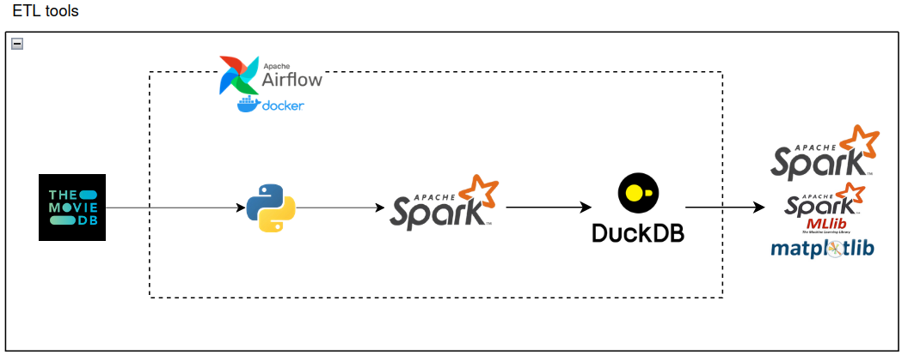

# Introduction.

### Research Subject  
The dataset consists of movie data from 500 pages, totaling approximately 10,000 movies released up to 2024, collected via a public API, specifically **The Movie Database (TMDB)** API. The dataset includes information such as movie IDs, titles, genres, release years, durations, ratings, and other relevant attributes.  

### Research Scope  
This project focuses on building and deploying an **ETL (Extract-Transform-Load)** system in a local environment with scalability to process large datasets. Subsequently, the project analyzes the collected movie data and applies machine learning models to create a personalized movie recommendation system. Key components are as follows:  

- **ETL Process**: Utilizing Python for data extraction, Apache Spark for data processing, and optimizing data storage.  
- **Database Management**: Storing normalized data in **DuckDB**.  
- **Data Analysis and Machine Learning**: Using Apache Spark to analyze data and implement recommendation algorithms.  
- **Automation System**: Automating the workflow with **Apache Airflow** deployed on **Docker**.  

# System Workflow. 

### 1. Data Extraction (Extract)  
- **Data Source**: Querying the API to retrieve:  
  - **Movie Details**: id, title, release date, language, ratings, genres, overview, etc.  
  - **Movie Ratings**: userName, userID, rating, review content, timestamp.  
- **Format**: Data extracted in JSON format and converted to CSV using Python.  

### 2. Data Transformation (Transform)  
- **Data Cleaning**: Removing missing and duplicate values.  
- **Storage Optimization**: Converting CSV files to Parquet format for reduced size and increased performance.  

### 3. Data Loading (Load)  
- **Database**: Loading the normalized data into **DuckDB** using Apache Spark.  

### 4. Data Analysis and Recommendation System  
- **Data Integration**: Connecting DuckDB to Spark via JDBC.  
- **Data Analysis**: Performing linear regression and visualizing data insights.  
- **Recommendation System**:  
  - Implementing machine learning algorithms such as **SGD** and **ALS**.  
  - Generating personalized movie recommendations for users.

### 5. Automation with Apache Airflow  
The workflow is automated using DAGs in Apache Airflow to systematically collect, process, and load data from The Movie Database API.  

# Movie Data Analysis.  
Data analysis is conducted using **Python** for data processing and **Matplotlib** for visualization to address the following questions:  

1. **What is the most common language in movies?**  
2. **What is the range of ratings and the number of reviews?**  
3. **Which genre is the most popular?**  
4. **When were most movies released?**  
5. **What is the correlation between various attributes in the dataset?**  
6. **What trends exist for review counts and average ratings?**

Details: 

# Movie recommendation model.  
The system evaluates the performance of **ALS** and **SGD** algorithms based on RMSE and visualizes the results to determine the most effective model for recommending movies to users.  

Details: 

# Project Setup and Execution.  

To run the project, follow these steps:  
1. Install [Docker](https://docs.docker.com/engine/install/).  
2. Set up [Apache Airflow](https://airflow.apache.org/docs/apache-airflow/stable/howto/docker-compose/index.html) on **Docker**.  
3. Open a terminal in the **airflow_docker** directory.  
4. Run the command `docker-compose up`.  
5. Access the Airflow UI at [**localhost:8080**](http://localhost:8080/home).  
6. Log in with **user: admin** and **password: admin**.  
7. Execute the pre-configured **ETL system**.  
8. Run the files  for movie analysis and  for the recommendation system.  

